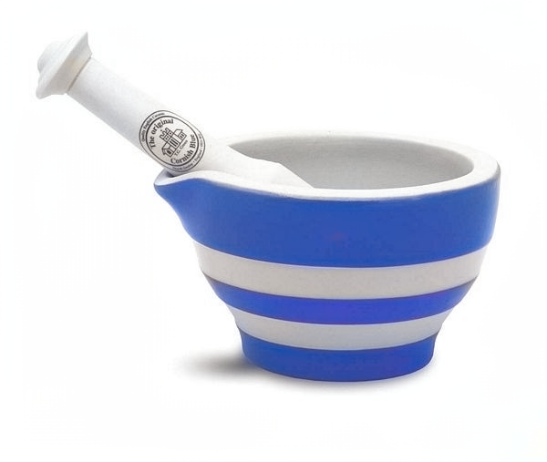
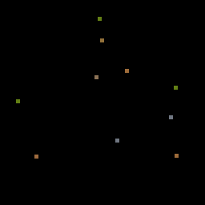

# colorization-pytorch-simple-PSE

This is a pytorch implementation of interactive colorization. These weights are in [Photoshop Elements 2020](http://video.tv.adobe.com/v/28291) and in [Photoshop Neural Filters](https://www.youtube.com/watch?v=iJs_nqu8P08).

Download [caffemodel](https://adobe-my.sharepoint.com/personal/rizhang_adobe_com/_layouts/15/guestaccess.aspx?guestaccesstoken=%2FgYfjXcZyCI4LOa%2B%2FHQrNTIH7m6gZooZBvrmmEjmmjc%3D&docid=2_0c3194addb7254cceb54c4dcca53adc53&rev=1&e=M94V1G) into the `weights` directory. It is from our [SIGGRAPH 2017](https://richzhang.github.io/ideepcolor/) paper. It was trained in caffe, with weights converted to pytorch. These are the weights in PSE 2020 and Neural Filters.

### "Migrant Mother" examples

```bash
# Automatic colorization
python run_model.py

# Pre-saved user interactions
python run_model.py --hint_ab_path imgs/migrant_mother/im_ab.npy --hint_mask_path imgs/migrant_mother/im_mask.npy
```

**Automatic results**


**User interactive results**


### Some more examples


  
  


  
  


  
  


  
  


  
  


  
  


  
  


  
  


  
  

### DRN_D_22 model

`drn_d_22` was an attempted retraining with a smaller model, but does not look as good. To activate it download the [drn_d_22](https://adobe-my.sharepoint.com/personal/rizhang_adobe_com/_layouts/15/guestaccess.aspx?guestaccesstoken=JGrVwgOjq2efK9%2FT1r2jyC0WZFMErSoE%2FQLzF1QDKT0%3D&docid=2_0c81bc71866df4cbcbff6337bcb54c46d&rev=1&e=M5GHRS), model and add it into the `weights` directory.

Then add the `--arch` and `--model_path` flags:

```bash
python run_model.py --arch drn_d_22 --model_path weights/drn_d_22_norebal_ep150.pth
```

